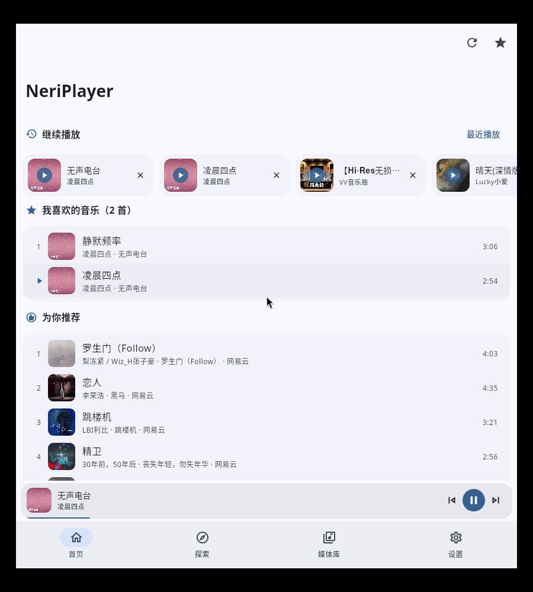
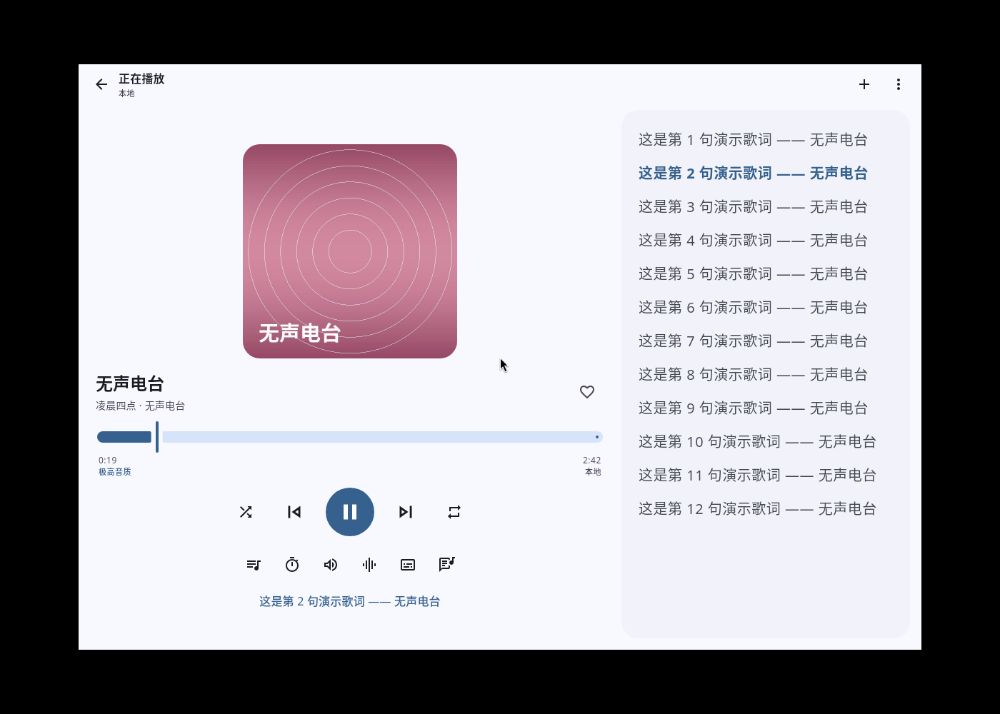
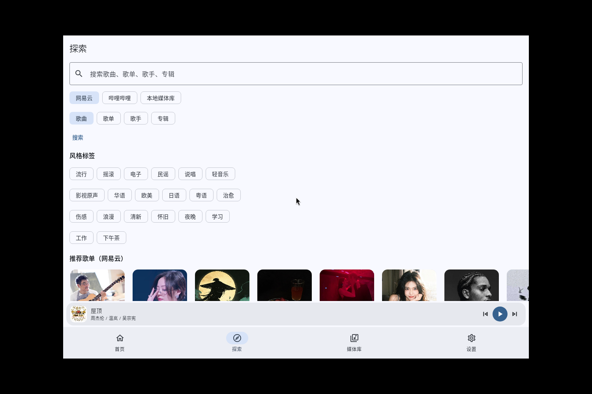
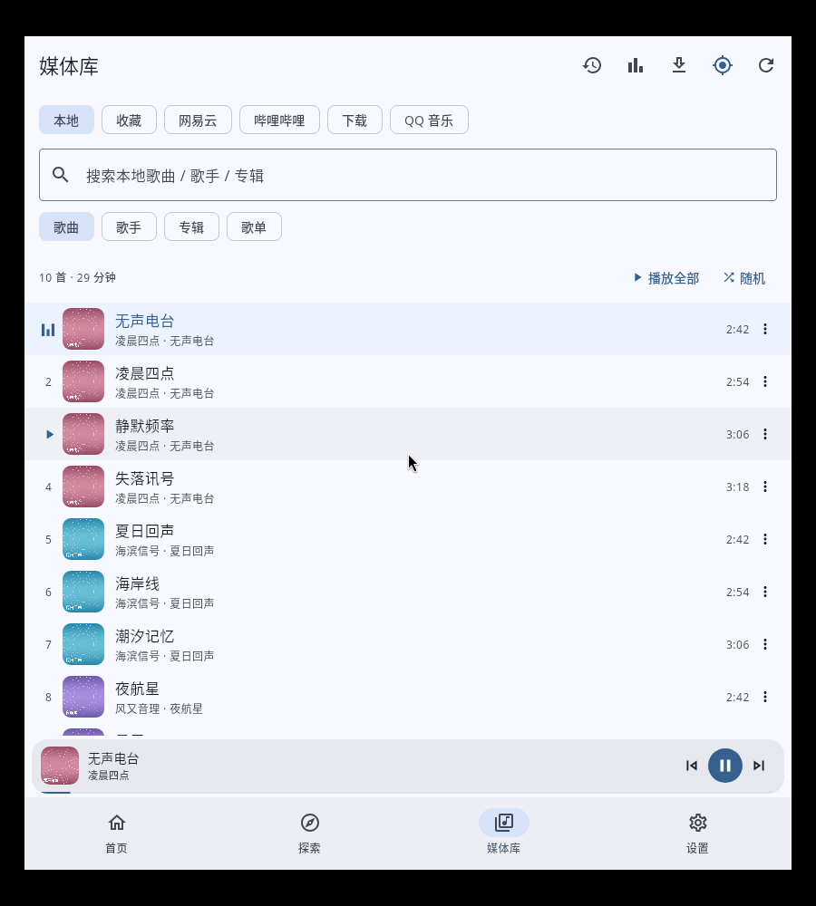
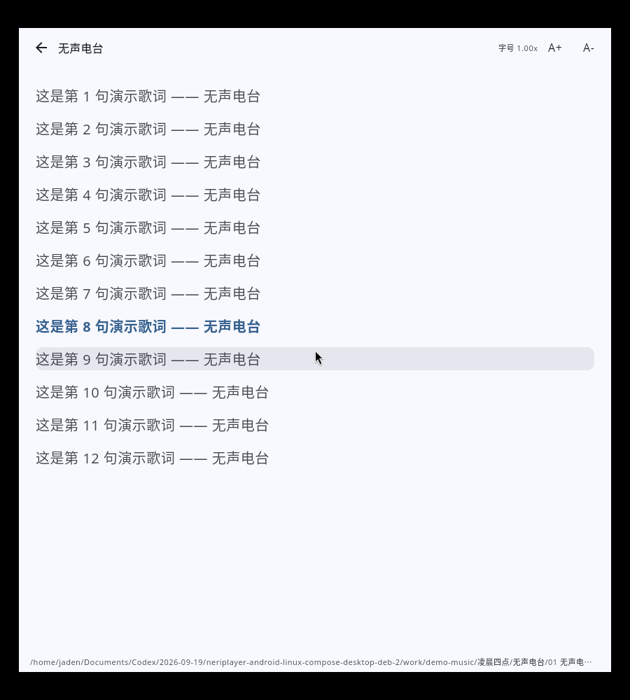
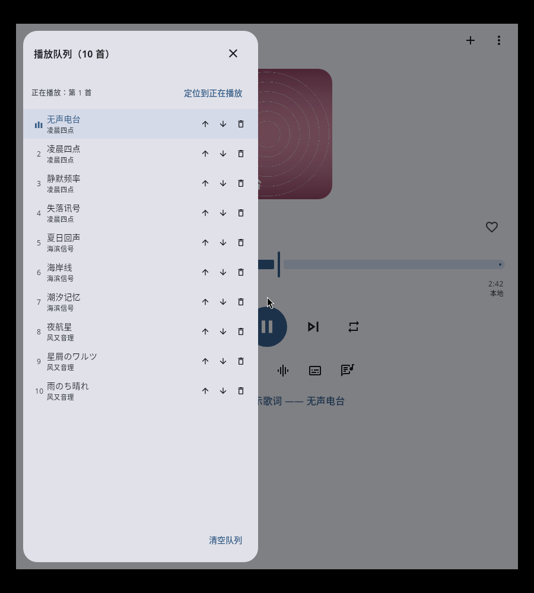
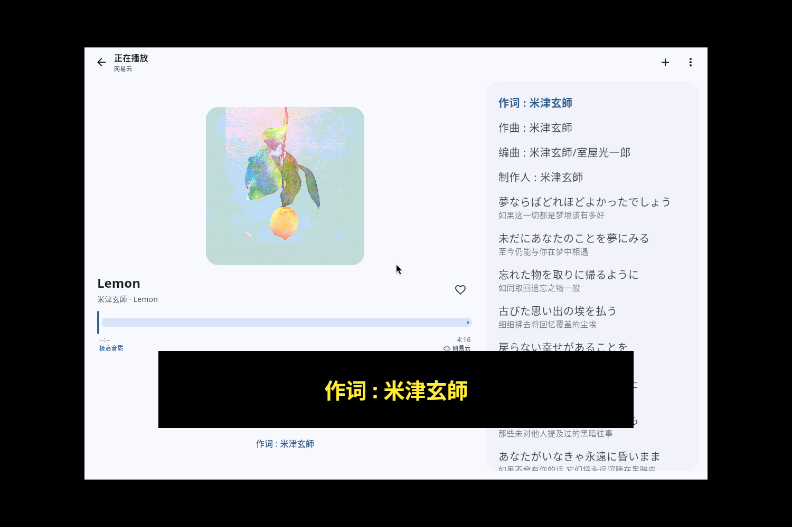
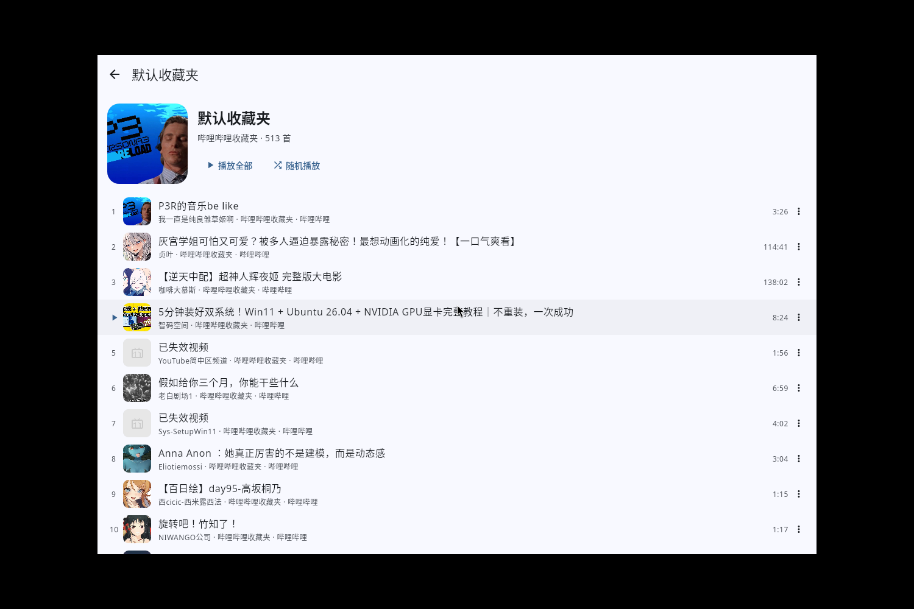
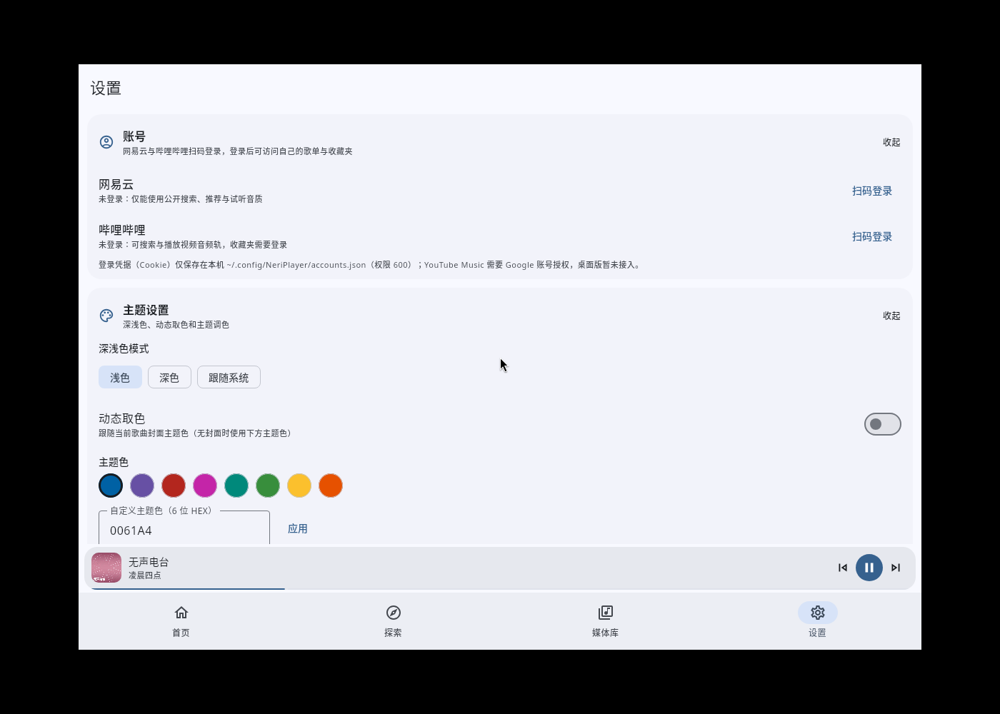
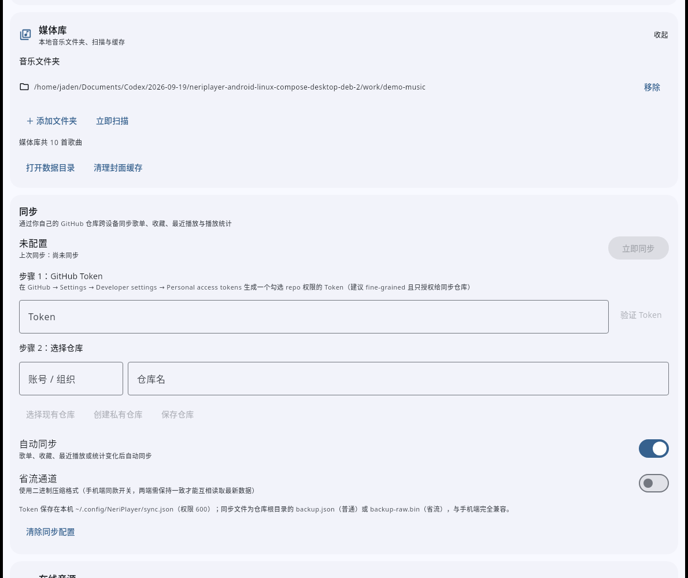

# NeriPlayer Desktop · 音理音理（Linux 原生版）

把 Android 应用 [NeriPlayer](https://github.com/cwuom/NeriPlayer) 重写为**不依赖 Android 运行环境**的 Linux 原生桌面应用。
技术栈是 Kotlin + Compose Desktop（JVM / Skia 渲染），打包为单个 `.deb`，安装即用。

<p align="center">
  
  
</p>

## 下载与安装

从 [Releases](https://github.com/Asternent/NeriPlayerForLinux/releases) 下载最新的 `neriplayer_<版本>-1_amd64.deb`：

```bash
sudo dpkg -i neriplayer_1.4.0-1_amd64.deb
neriplayer          # 或从应用菜单启动「NeriPlayer」
```

- 安装包内置 jlink 运行时，终端用户**不需要**安装 JDK。
- **建议安装 `ffmpeg`**：用于解码 m4a / aac / opus 等格式，并提供倍速、变调、响度增强与十段均衡器；
  缺少时自动降级到 Java Sound 引擎（mp3 / flac / ogg / wav / aiff 仍可播放）。
- 首次启动显示使用须知，随后在「设置 → 媒体库」添加音乐文件夹并扫描即可建立本地曲库。

## 界面预览

| | |
| --- | --- |
| 首页：继续播放 / 推荐 / 热歌榜 <br>  | 探索：多源搜索与风格标签 <br>  |
| 媒体库：本地 / 收藏 / 在线音源 <br>  | 播放页：封面、进度、音效与队列 <br>  |
| 歌词页：逐行高亮与翻译 <br>  | 播放队列：排序 / 移除 / 跳转 <br>  |
| 悬浮歌词（描边样式，可拖动定位） <br>  | 哔哩哔哩收藏夹 <br>  |
| 设置 → 账号：网易云 / 哔哩哔哩扫码登录 <br>  | 设置 → 同步：GitHub 跨设备同步 <br>  |

## 功能清单

| 功能 | 状态 |
| --- | --- |
| 首页（继续播放 / 为你推荐 / 热歌榜 / 推荐新歌 / 私人雷达 / 热门榜单） | ✅ 网易云公开接口 + 本地栏目回退 |
| 探索（多源搜索、搜索历史、热门搜索、风格标签、推荐歌单） | ✅ 网易云 / 哔哩哔哩 / 本地媒体库 |
| 媒体库（本地 / 收藏 / 网易云 / 哔哩哔哩 / QQ 音乐） | ✅ 本地歌曲 · 歌手 · 专辑 · 歌单；在线歌单、专辑与收藏夹 |
| 本地媒体库 | ✅ 文件夹扫描、读取标签与内嵌封面、搜索与排序 |
| 播放引擎 | ✅ ffmpeg 解码（倍速 / 变调 / 响度 / 十段均衡器）+ Java Sound 回退引擎 |
| 歌词 | ✅ 本地 `.lrc` → 内嵌标签 → 在线歌词；翻译、逐行高亮、点击跳转、字号调节 |
| 悬浮歌词 | ✅ 无边框置顶窗口，可拖动定位，样式与手机端一致 |
| 账号登录 | ✅ 网易云与哔哩哔哩应用内扫码登录 |
| GitHub 同步 | ✅ 歌单 / 收藏 / 最近播放 / 播放统计，与手机端数据互通 |
| 歌单与收藏 | ✅ 自建歌单、我喜欢的音乐、增删与排序 |
| 最近播放 / 继续播放 | ✅ 支持移除单条与清空 |
| 播放统计 | ✅ 日 / 周 / 月 / 年 / 总，按次数、时长、最近排序 |
| 播放队列 / 睡眠定时器 | ✅ 队列增删排序、倒计时与播完当前停止 |
| 主题 | ✅ 深浅色、动态取色跟随封面、9 种 Material 调色风格、2021 / 2025 色彩规范 |
| 与手机端同步协议互通 | ✅ 同一仓库、同一文件格式（JSON 与省流二进制） |
| 定位到正在播放 | ✅ 列表高亮当前歌曲（播放指示器）+ 一键滚动定位并闪烁提示 |
| 歌曲下载到本地 | ✅ 单曲 / 批量下载、进度与取消重试、离线播放、下载分栏与管理面板 |
| 后台常驻与系统控制 | ✅ 托盘常驻后台播放 + 托盘菜单控制 + 系统媒体控制（MPRIS，媒体键 / 桌面媒体组件 / playerctl） |

### 与原 Android 应用的差异

以下能力是 Android 平台专有或依赖系统服务，桌面端不适用或未移植：
状态栏歌词、桌面小组件、启动器快捷方式、USB DAC 独占、省电保活与 ANR 日志、下载管理、
一起听（依赖自建服务端）；YouTube Music 需要 Google 账号授权与专用解析，桌面端保留入口与说明。

## 快捷键

| 按键 | 作用 |
| --- | --- |
| `空格` | 播放 / 暂停 |
| `←` / `→` | 后退 / 前进 5 秒 |
| `↑` / `↓` | 音量 +5% / −5% |
| `Ctrl` + `←` / `→` | 上一首 / 下一首 |
| `Ctrl` + `L` | 开关悬浮歌词 |

## 使用说明

### 登录网易云与哔哩哔哩

1. 打开「设置 → 账号」；
2. 点对应平台的 **扫码登录**，用手机 App（网易云「扫一扫」/ 哔哩哔哩「＋ → 扫一扫」）扫码确认；
3. 登录后媒体库会多出「我的歌单」与「我的收藏夹」，在线播放也会使用账号可用的更高音质。

凭据（Cookie）只保存在本机 `~/.config/NeriPlayer/accounts.json`（权限 600）。不登录也能使用搜索、推荐、歌词与试听音质。

### GitHub 同步

与原 Android 端共用同一套协议：数据写在你自己的 GitHub 仓库根目录，普通通道 `backup.json`、
省流通道 `backup-raw.bin`（GZIP + Protobuf），两端可互相读写。

1. 在 GitHub 生成带 `repo` 权限的 Token（建议 fine-grained 且只授权给同步仓库），填入并点「验证 Token」；
2. 点「创建私有仓库」或「选择现有仓库」；
3. 开启「自动同步」后，歌单 / 收藏 / 最近播放 / 统计变化会在 15 秒内自动同步；也可随时「立即同步」。

合并策略：歌单按修改时间取新、歌曲取并集并尊重删除墓碑；最近播放按歌曲身份去重取最新；
播放统计按身份 + 日期分桶取 `max`（避免两端重复计数）。提交走 Git 数据接口并带读取时的 HEAD，
其他设备并发提交会被判定为冲突并自动重试。Token 保存在 `~/.config/NeriPlayer/sync.json`（权限 600）。

### 悬浮歌词

- 开启：设置 → 悬浮歌词，或播放页工具栏按钮，或快捷键 `Ctrl+L`；
- **鼠标拖动**即可移动，位置按屏幕比例保存，换分辨率或多屏不会跑出屏幕；
- 鼠标悬停会浮出「上一首 / 播放暂停 / 下一首 / 关闭」；
- 样式：十种歌词颜色、阴影与描边两种渲染（含颜色、宽度 / 模糊）、字号、
  主歌词与翻译不透明度、背景颜色与不透明度、最大宽度、对齐方式、显示翻译、切换淡入；
- 「应用内隐藏」避免遮挡主窗口，「锁定位置」防止误拖动。

> 透明背景需要系统启用窗口合成器（GNOME / KDE / XFCE 默认开启）；未启用时会退化为不透明底色。

### 定位到正在播放

列表里正在播放的歌曲会**高亮显示**，序号位置变成跳动的音量条；顶部「定位」按钮
（歌单详情、在线歌单 / 收藏夹、媒体库本地列表）与队列面板里的「定位到正在播放」
会滚动到该行并让它**闪烁提示**；当前歌曲不在该列表时会明确提示「当前歌曲不在该列表中」。
队列面板打开时自动定位到正在播放，切换歌曲后也会跟随。

### 下载到本地

与原应用一致：把在线歌曲存到本地，离线也能播放。

- 单曲：歌曲「更多」菜单 → 下载到本地；批量：歌单 / 专辑 / 收藏夹详情顶部 → 下载全部
- 媒体库新增「下载」分栏，列出已下载歌曲（可直接播放、删除文件、打开目录）
- 下载管理面板：进度条、取消、重试、清空已完成、打开下载目录；媒体库顶栏有下载入口（带进行中数量角标）
- 已下载歌曲在列表中显示离线标记，播放时**优先使用本地文件**，断网也能放
- 设置 → 下载：下载目录（可选）、并发数（1–4）、下载音质（标准 / 较高 / 极高 / 无损）、占用统计与失效记录清理

下载完成时会一并写入元数据，与手机端行为一致：

- 把标题 / 艺术家 / 专辑 / 歌词写进音频**内嵌标签**，其它播放器也能看到完整信息
- 封面**内嵌进音频文件**，同时保存为同名 sidecar 图片（`歌手 - 标题.jpg` / `.png` / `.webp`）
- 歌词保存为同名 `.lrc`（本地歌词优先级链路可以直接读取，离线也能看歌词）
- 下载管理面板提供 **「补齐标签」**：为旧版本下载（或缺标签）的文件补写封面与歌曲信息，无需重新下载

### 后台常驻与系统控制

对应手机端的「前台服务 + 通知栏控制」，桌面端用**系统托盘**与**MPRIS**实现：

- **关闭窗口 = 最小化到托盘**（默认开启）：窗口隐藏后音乐继续播放，托盘菜单可重新打开或退出；
  最小化窗口同样会收进托盘（可在设置里关掉这两种行为）
- **托盘菜单**：显示主窗口 / 上一首 / 播放暂停 / 下一首 / 开关悬浮歌词 / 退出；鼠标悬停显示「正在播放：歌曲 - 歌手」
- **系统媒体控制（MPRIS）**：注册 `org.mpris.MediaPlayer2.neriplayer`，键盘媒体键、GNOME / KDE 媒体组件、
  `playerctl` 都能直接控制本应用（播放 / 暂停 / 上下曲 / 循环模式 / 随机 / 音量 / 跳转），并读取当前歌曲与封面
- **歌曲变化通知**：窗口隐藏时发送系统通知（可在设置里关闭）
- 窗口标题也会跟随显示「▶ 歌曲 - 歌手」，任务栏一眼可见

> 需要桌面环境提供托盘面板；极简环境（如裸 Xvfb）没有托盘时会自动退回普通窗口模式，不会崩溃。
> MPRIS 需要 D-Bus 会话总线（GNOME / KDE / XFCE 默认提供），设置页会显示注册状态。

## 数据目录（XDG）

| 路径 | 内容 |
| --- | --- |
| `~/.config/NeriPlayer/settings.json` | 设置、主题、队列与进度快照 |
| `~/.config/NeriPlayer/accounts.json` | 网易云 / 哔哩哔哩登录凭据（权限 600） |
| `~/.config/NeriPlayer/sync.json` | GitHub 同步配置与 Token（权限 600） |
| `~/.local/share/NeriPlayer/library.json` | 本地媒体库索引 |
| `~/.local/share/NeriPlayer/playlists.json` | 歌单与「我喜欢的音乐」 |
| `~/.local/share/NeriPlayer/history.json` | 最近播放 |
| `~/.local/share/NeriPlayer/stats.json` | 播放统计 |
| `~/.cache/NeriPlayer/artwork`、`covers` | 内嵌封面提取与在线封面缓存 |

## 从源码构建

需要 JDK 17+ 与网络（首次构建会下载 Maven 依赖）：

```bash
./gradlew run            # 直接运行
./gradlew packageDeb     # 生成 build/compose/binaries/main/deb/neriplayer_<版本>-1_amd64.deb
```

### 测试

```bash
./gradlew selfTest                  # 核心自检：解码 / 播放 / 跳转 / 变速 / 歌词 / 在线接口 / 同步与悬浮歌词算法
./gradlew syncE2E -DGH_TOKEN=xxx     # GitHub 同步真实端到端（会创建并自动删除一个临时私有仓库）
python3 tools/mock_github.py 8765    # 无 Token 时用本地 GitHub API 模拟服务跑 syncE2E（配合 GH_MOCK_BASE）
```

界面回归通过脚本驱动：设置环境变量 `NERIPLAYER_UI_TEST="tab:library;play:0;pause;sleep:9000;expect-paused"`
即可让应用自动执行一串操作并输出断言结果，便于在无人值守环境下验证界面行为。

## 代码结构

```
desktop/
├── src/main/kotlin/moe/ouom/neriplayer/desktop/
│   ├── Main.kt                 应用入口、窗口、悬浮歌词窗口与快捷键
│   ├── core/                   数据模型、XDG 存储、媒体库扫描、歌单与统计、播放引擎与播放器
│   ├── net/                    HTTP 客户端、网易云接口、哔哩哔哩 WBI 签名接口、扫码登录
│   ├── sync/                   GitHub 同步：数据模型、序列化、Git 传输、合并策略
│   ├── ui/                    主题、通用组件、悬浮歌词、同步与账号设置、各页面
│   └── tools/                 自检与界面自动化脚本
├── docs/screenshots/           界面截图
└── packaging/                  deb 图标与许可文件
```

## 已知限制

- 在线音源通过各平台公开接口访问，音频地址具有时效性；播放失败会自动提示并可重试。
- 哔哩哔哩收藏夹列表接口不返回封面，未打开过时显示占位图标，打开过一次后会缓存首条封面。
- 未启用窗口合成器的桌面环境无法显示透明背景（退化为不透明底色）。
- 多 P 视频（合集）目前播放第一段音频轨。

## 许可

与原项目一致，以 **GPL-3.0** 发布（见 [packaging/LICENSE](packaging/LICENSE)）。
本项目仅供学习与研究使用，请遵守各平台服务条款；不提供任何媒体内容、密钥，
也不具备绕过付费 / DRM / 地区限制的能力。
